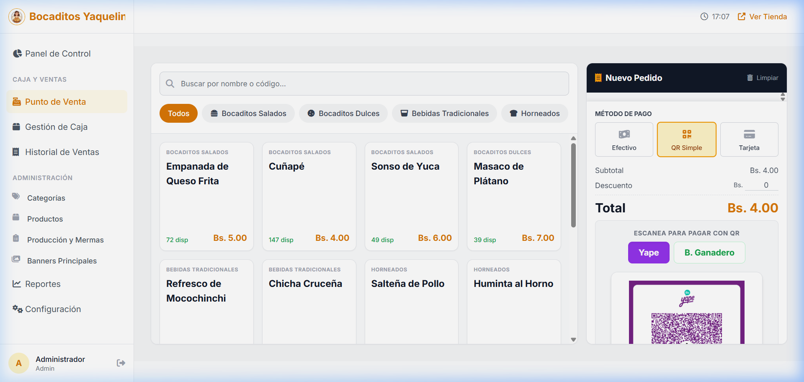
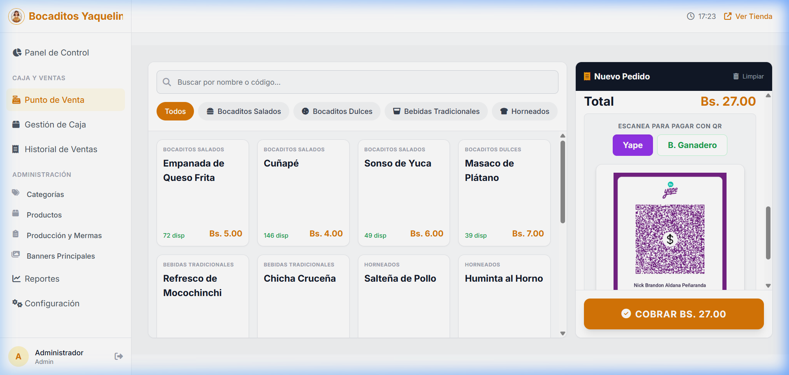

# Sistema POS - Bocaditos Yaquelin

Sistema integral de Punto de Venta (POS) y Administración de Inventario, diseñado específicamente para **Bocaditos Yaquelin**.

## 🚀 Características Principales

- **Punto de Venta (POS):** Interfaz ágil para ventas rápidas con cobro en Efectivo o pagos digitales, selector visual de QR, cálculo automático de vuelto.
- **Tickets Térmicos:** Generación instantánea de recibos de venta adaptados a impresoras térmicas de 80mm.
- **Control de Inventario:** Gestión de productos, control de stock y mermas. El stock se descuenta automáticamente con cada venta.
- **Gestión de Caja:** Apertura y cierre de caja, control de flujo y cálculo automatizado para detectar descuadres.
- **Reportes Visuales:** Estadísticas mensuales de ingresos, productos más vendidos (Top 5) y desglose por método de pago.
- **Configuración y Landing Page:** Personalización del negocio (WhatsApp, Redes, Logo) en tiempo real, reflejándose en una Landing Page pública y en los tickets.

## 📸 Capturas de Pantalla

### 1. Interfaz de Punto de Venta y Cobro QR

### 2. Panel Lateral de Carrito (Scroll Dinámico)

### 3. Ticket de Venta (Formato Térmico 80mm)

## 🛠️ Stack Tecnológico

- **Backend:** Laravel 11 (PHP 8)
- **Frontend Interactividad:** Alpine.js
- **Frontend Estilos:** Tailwind CSS
- **Base de Datos:** MySQL (Gestión concurrente con transacciones)
